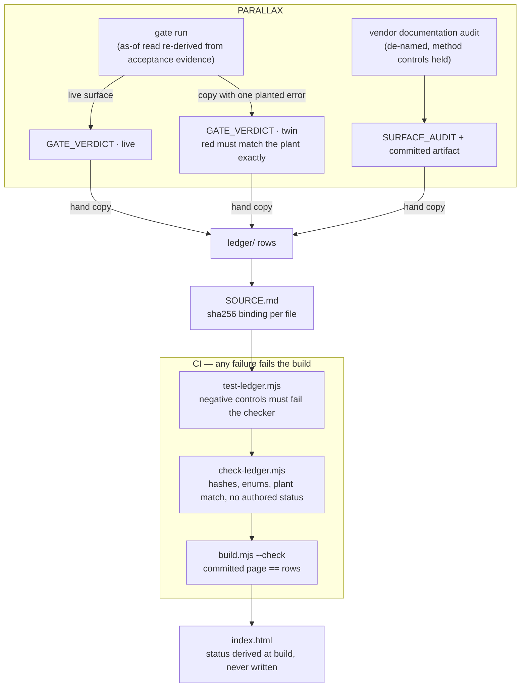

# BASELINE

Live: https://baseline-beryl.vercel.app/

A conformance ledger for point-in-time correctness of fundamentals read
surfaces. Every read surface handles restatements against a baseline that is
**zero** (revisions overwrite in place), **unknown** (history exists but no
as-of query can reach it), or **flexing** (an as-of mode exists but its
boundary moves). BASELINE records what the
[PARALLAX](https://github.com/hossainpazooki/parallax) PIT gate has shown
about named surfaces, as dated machine-checkable rows rendered on one page:
each row resolves to a replayable gate run for the technical reader, and to
one sentence for everyone else. The rule the build enforces: **nothing on the
page may claim more than the rows.** The ledger reports on surfaces; it
serves no data.

## How a row earns the page



The `live`/`twin` pair is the crediting rule: a lane is `CLAIMABLE` only when
the live surface gates green **and** the same gate, on a copy with one planted
error, goes red for exactly the planted reason. Statuses (`CLAIMABLE` /
`PARTIAL` / `UNCLAIMED` / `UNEVALUABLE`) are recomputed from rows at every
build; a status literal found in any row fails the build. Rows are
hash-anchored and unsigned — signing is a planned extension.

## Verify

```
node scripts/test-ledger.mjs    # the checker's own negative controls
node scripts/check-ledger.mjs   # the ledger gate
node scripts/build.mjs --check  # committed page matches the ledger
```

## Where things are

`ledger/` rows + `SOURCE.md` bindings and the replay command · `scripts/` the
three tools above · `docs/specs/` the governing design and its as-built
amendments · dated results live in `STATUS.md` and the rows, not here.
